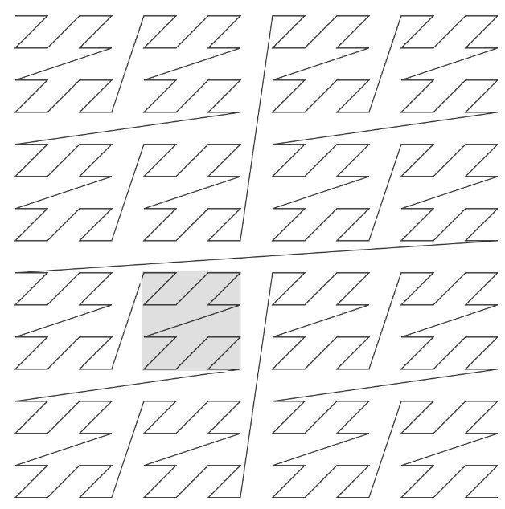
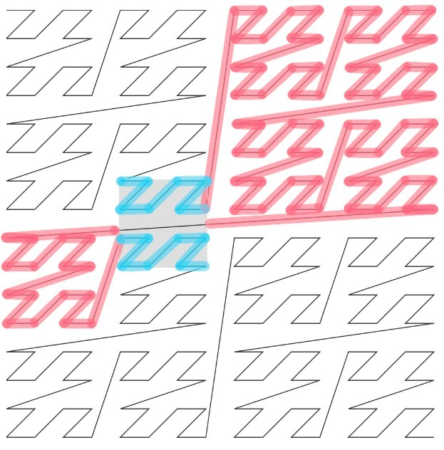

# ZIndex

Proof of concept for a very fast cloud-native static spatial index for 2D points based on a Z-Order space filling curve and BIGMIN search space pruning.

- See the `index.py` file for creating the .parquet file from an .osm.pbf file
- See the `query.py` file as an example for querying the .parquet file

Thanks to [Marco Neumann](https://github.com/crepererum) helping me understand Parquet.


## Usage

I have generated the file `berlin-latest-hydrants.parquet` and have a GitHub Page serve it

```bash
python3 index.py berlin-latest.osm.pbf -o berlin-latest-hydrants.parquet
```

This means we can make queries against the remotely Parquet file with DuckDB

```sql
SELECT
  lng, lat
FROM
  'https://daniel-j-h.github.io/zindex/berlin-latest-hydrants.parquet'
WHERE
  z IN (3771320898, 3771320904)
  AND lng BETWEEN 2307450897 AND 2307489074
  AND lat BETWEEN 3400700224 AND 3400740787
```

```
┌────────────┬────────────┐
│ lng        ┆ lat        │
╞════════════╪════════════╡
│ 2307451925 ┆ 3400717306 │
│ 2307467484 ┆ 3400723676 │
│ 2307452687 ┆ 3400716838 │
│ 2307471065 ┆ 3400728515 │
│ 2307473447 ┆ 3400717329 │
│ 2307462469 ┆ 3400727098 │
│ 2307458019 ┆ 3400734922 │
└────────────┴────────────┘
```

or even from a browser e.g. with [DuckDB-WASM](https://www.npmjs.com/package/@duckdb/duckdb-wasm).
Try out the query above in a DuckDB-WASM Shell [here](https://shell.duckdb.org/#queries=v0,SELECT-lng%2C-lat-FROM-'https%3A%2F%2Fdaniel%20j%20h.github.io%2Fzindex%2Fberlin%20latest%20hydrants.parquet'-WHERE-z-IN-(3771320898%2C3771320904)-AND-lng-BETWEEN-2307450897-AND-2307489074-AND-lat-BETWEEN-3400700224-AND-3400740787~).

Note that in the query above the `WHERE z IN (..)` makes the query efficient since the parquet file is sorted by Z values.
The clauses `AND lng BETWEEN lngmin AND lngmax` and `AND lat BETWEEN latmin AND latmax` then run subsequent filtering steps on all items contained within the specific Z values.
The two implementation approaches described below show how to tune the query for the first and second filtering step for your use case.

## How It Works

We sort 2d points along a Z-order space-filling curve and query for them efficiently.

Then there are two approaches:
Both make efficient byte-range requests against a single Parquet file.


### Simple Approach

We implement a simple approach after talking to [Sarah Hoffmann](https://github.com/lonvia) pointing out use cases for which this approach is good enough.
The simple approach works as follows:
With a bounding box query, discretize the min and max locations on a 16-bit grid and simply iterate over all possible values.

```python
for lng16 in range(lngmin16, lngmax16):
    for lat16 in range(latmin16, latmax16):
        z32 = zencode32(lng16, lat16)
```

This is simple to implement on the query side and should work well for use cases e.g. where the data is not too dense so that a single 16-bit grid cell contains a large amount of items to subsequently filter.


### BIGMIN Optimization

We use an optimization ("BIGMIN") to skip over irrelevant data when walking the curve.
The BIGMIN approach works as follows:
With a bounding box query, get the Z-Curve value for its min and max location.
Then walk this linear range of Z values and use the BIGMIN optimization to skip over irrelevant data.

```python
z = zmin

while z < zmax:
    z = zindex.next_zorder_index(z)
```

This is more difficult to implement on the query side but generalizes well for more use cases.

| Z-curve with query bounding box | Z-curve with BIGMIN skipping |
|-|-|
|  |  |

If you are interested in a high-level overview check out [my blog post](https://www.openstreetmap.org/user/daniel-j-h/diary/406584) and see [zbush](https://github.com/daniel-j-h/zbush/).


## License

Copyright © 2025 Daniel J. H.

Distributed under the MIT License (MIT).
